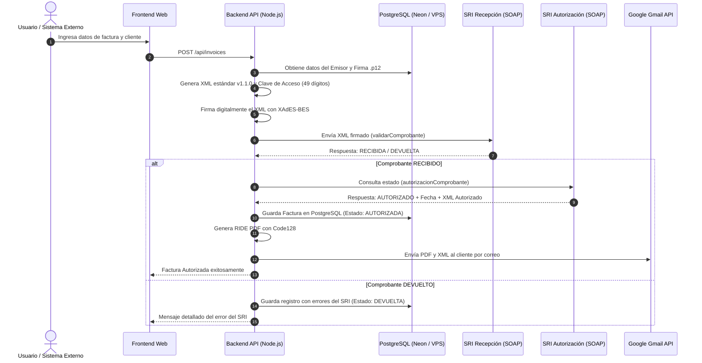

# Arquitectura del Sistema: Lojafac Facturación SRI

## 1. Visión General y Flujo de Emisión

---

## 2. Componentes Desacoplados

1. **Frontend (`/apps/frontend` o UI):**
   * Puntos de Venta (POS rápido), catálogos de clientes, inventarios y reportes.
   * Totalmente agnóstico del servidor; solo consume endpoints REST.

2. **Backend API (`/apps/backend` o API REST):**
   * Manejo de la lógica tributaria ecuatoriana y comunicación con el SRI.
   * Endpoints protegidos para integraciones con Ecommerce (WooCommerce, Shopify) o ERPs.

3. **Base de Datos (PostgreSQL):**
   * Almacén centralizado de alta concurrencia en **Neon** (o en tu VPS propio).
   * Almacena XMLs autorizados, PDFs RIDE, historial de clientes y firmas electrónicas cifradas.
