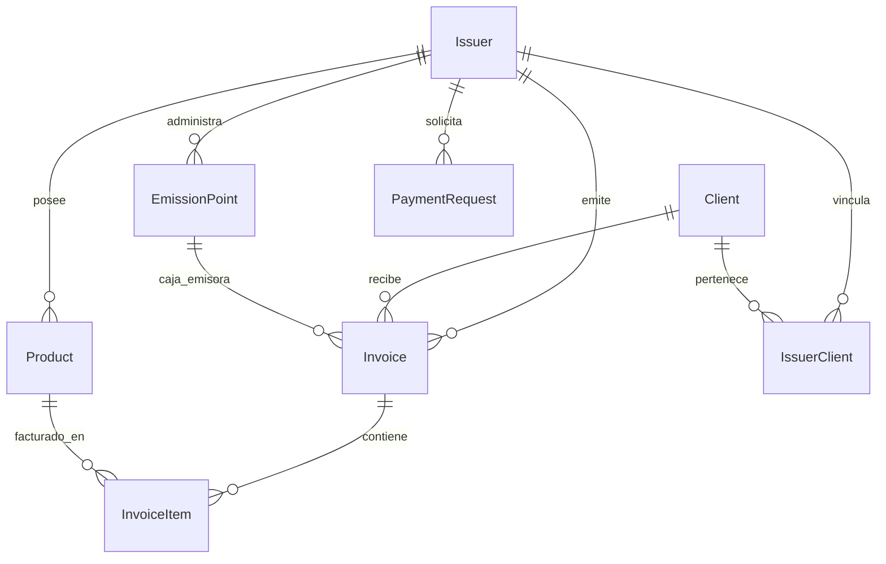

# Base de Datos: PostgreSQL (Neon / VPS)

## 1. Esquema de Entidades y Relaciones

---

## 2. Modelos Principales

### `Issuer` (Empresa / Contribuyente)
* `ruc`: RUC único de 13 dígitos.
* `razonSocial`: Razón social registrada en el SRI.
* `ambiente`: `1` (Pruebas) o `2` (Producción).
* `firmaElectronica`: Certificado digital `.p12` en Base64 (`@db.Text`).
* `codigoSri`: Clave del archivo `.p12`.
* `apiKey`: Llave única para emisión por API REST.

### `Invoice` (Comprobante Electrónico)
* `secuencial`: 9 dígitos (ej. `000000005`).
* `establecimiento`: 3 dígitos (ej. `001`).
* `puntoEmision`: 3 dígitos (ej. `001`).
* `claveAcceso`: Clave de 49 dígitos `@unique`.
* `estado`: `CREADA`, `FIRMADA`, `RECIBIDA`, `AUTORIZADA`, `DEVUELTA`, `ANULADA`.
* `xmlNoFirmado` / `xmlAutorizado` / `pdfRIDE`: Campos `@db.Text`.

### `EmissionPoint` (Puntos de Emisión / Cajas)
* Permite crear múltiples cajas (`001`, `002`, `003`) con login independiente para cajeros y numeración correlativa separada.
